# Bio-inspired underwater image enhancement

Following is a submission for the final project of [Natural and Artificial Vision](https://www.mccormick.northwestern.edu/computer-science/academics/courses/descriptions/396-19.html) course taught by [Dr. Emma Alexander](https://www.alexander.vision/emma) at Northwestern University during Spring 2023.

<!-- ## Table of Contents
1. [Why is underwater imaging challenging?](#why-is-underwater-imaging-challenging?)
2. [Example2](#example2)
3. [Third Example](#third-example)
4. [Fourth Example](#fourth-examplehttpwwwfourthexamplecom) -->

## Motivation
The ocean contains abundant resources and a rich ecosystem. Despite the fact that ocean covers 70% of earth's surface and plays a key role in supporting life on earth, it is still underexplored by humans. Exploring the secrets of ocean ecosystems has the potential to uncover fresh reservoirs of medicinal treatments, vaccines, food sources, energy solutions, and other valuable resources. Furthermore, it can serve as a wellspring of inspiration for developing innovations that imitate the remarkable adaptations of deep-sea creatures. Underwater imaging plays a crucial role in underwater operations by human or robot. However due to the suspended particles and light attenuation the underwater images often suffer from color distortion, low contrast and hazing effects. improving quality of underwater images will help with deep sea exploration and will help marine biologists to understand the life under sea better. Color distortion and hazing effect in the underwater images poses a difficult challenge for computer vision application. Further the artifacts observed in underwater images are quite different from what we observe in other images. Hence there's a need of an image enchancement technique that is tailored for underwaterimages. 
## Why is underwater imaging challenging?

To understand this let's go through a simplified underwater imaging model described in [[1]](#1). 

<!-- 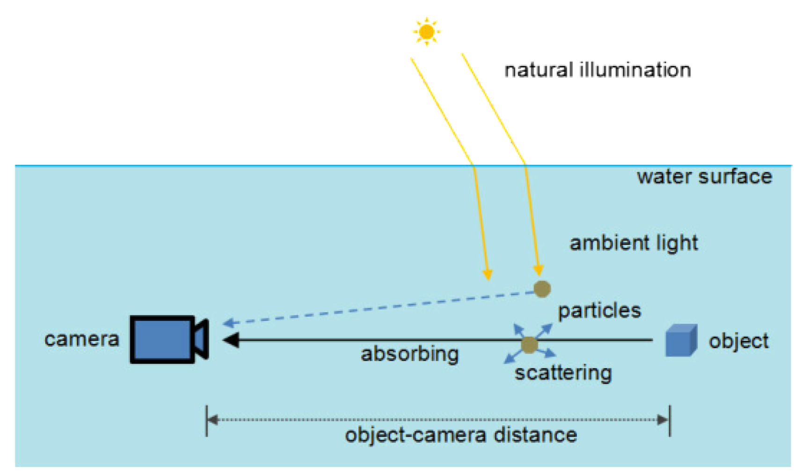
*img_caption* -->

<figure>
  
    

      <figcaption>Figure 1: underwater imaging model [1].</figcaption>
  

</figure>

From figure 1 above we can observe two key phenomenon that affect the quality of underwater images. 

1) **Scattering of light**: The light gets scattered due to presence of tiny suspended particles in water bodies. Scattering changes direction of light which makes the captured image hazy and noisy. 

<figure>
  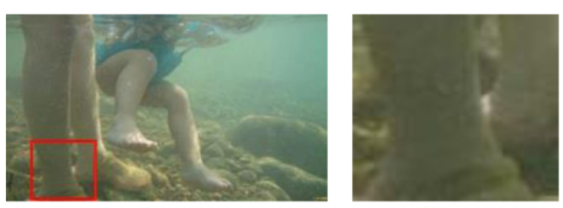
    

      <figcaption>Figure 2: hazing effect in underwater images[1].</figcaption>
  

</figure>

2) **Absorption of light**: 
The different wavelengths experience different level of absorption underwater, resulting in a pervasive color bias in underwater images. The uneven attenuation in the water leads to differences in how wavelengths of light are affected, ultimately impacting the overall color appearance of underwater photographs. This effect results in color distrotion in the captured images as shown in Figure 3.

<figure>
  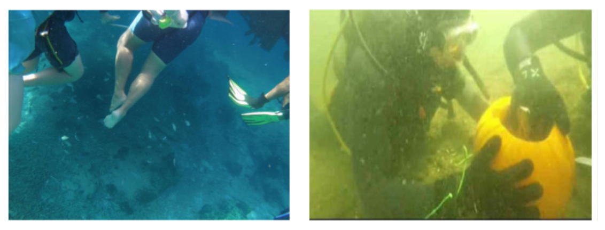
    

      <figcaption>Figure 3: color distortion in underwater images [2].</figcaption>
  

</figure>

## Two pathways of visual information

In human visual system broadly there're two visual pathways of information namely Magnocellular and Parvocellular pathways [[3]](#3). The magnocellular pathway is responsible for transmitting signals related to large, rapidly moving objects, with a focus on low spatial frequency and high temporal frequency. This pathway, however, does not process color information. On the other hand, the parvocellular pathway carries information about small, slowly moving objects that are rich in color. It specializes in high spatial frequency and low temporal frequency perception. These pathways are illustrated in figure 4. 

<figure>
    
  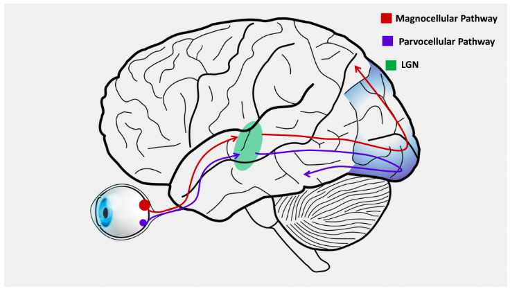
    

      <figcaption>Figure 4: Magnocellular and parvocellular pathways [3].</figcaption>
  

</figure>

Zooming in to the retina of human eyes (Figure 5) each of these pathways are connected to different types of cells. The magnocellular pathway is connected to Parasol cells  and parvocellular pathway is connected to midget cell. 

<figure>
  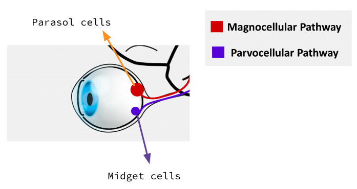
    

      <figcaption>Figure 5: Retina zoomed in [3].</figcaption>
  

</figure>

The Parasol and Midget cells exhibit various properties which are very interesting. The Parasol cells are color blind and are more sensitive to low spatial frequencies. The Parasol cells are responsible for knowing **where** objects are. On the other hand Midget cells have a smaller receptive filed than parasol cells which makes them more sensitive to medium and high spatial frequencies. The midget cells are responsibele for knowing **what** objects are. The size comparison of these cells is shown in Figure 6.

<figure>
  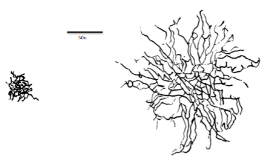
    

      <figcaption>Figure 6: Midget(left) vs parasol cells(right) [4].</figcaption>
  

</figure>

## Bio inspired vision system
Inspired by the two types of visual pathways Yang et al. [[5]](#5) developed a biological vision inspired framework for image enhancement in poor visibility conditions. They have decomposed the image in two pathways namely structure and detail pathways. They have used total-variation (TV) energy based image
decomposition method [[6]](#6). This image decomposition is illustrated in Figure 7. 

<figure>
  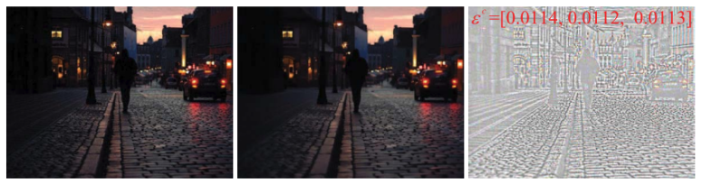
    

      <figcaption>Figure 7: input image (left), Base or structure layer (middle) , detail layer (right) [5].</figcaption>
  

</figure>

Generally in low visiblity images there is a lot of noise in darker regions. Directly improving the light of image results in amplification of these noises.  Yang et al. [[5]](#5) proposed to suppress the noise in a separate pathway (detail pathway) and adjust the lighting of image in structure pathway. The proposed framework is depicted in Figure 8.

<figure>
  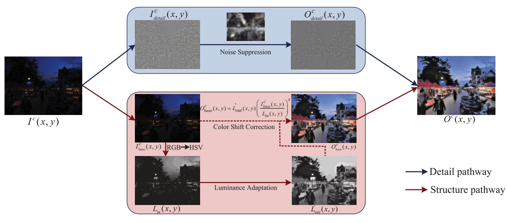
    

      <figcaption>Figure 8: Proposed framework[5].</figcaption>
  

</figure>

### Luminance adaptation in Structure pathway

In the proposed framework visual adaptation and luminance changes are performed in the structure pathway. To obtain the luminance infromation first the base image (structure of image) is converted from RGB to HSV, then the V channel is extracted s the luminance information. To adjust the luminance of image they have employed a modified version of  well-known Naka-Rushton (NR) equation [[7]](#7). Computationally, they have revised NR equation by including thespatial dependency in the luminous regulation, as the classical Naka-Rushton is a global equation. The equaltion is depicted in Figure 9.

<figure>
  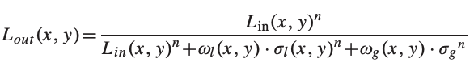
    

      <figcaption>Figure 9: Luminance adaptation in structure pathway [5].</figcaption>
  

</figure>

Now instead of directly converting the HSV image back to RGB space the authors have employed color shift correction method to avoid oversaturation in darker regions.

### Noise suppression in detail pathway

The authors have employes noise suppression in detail pathway to avoid the disturbance from low frequency information to certain extent. The authors have hypothesized that the regios with lowest local energy represent the noise level of image. Therefore, they have first calculated noise estimation map using gaussian filter. Then they are weighting the detail map with this noise estimation which in turn suppresses noise in the output image. This effect is depicted in Figure 10.

<figure>
  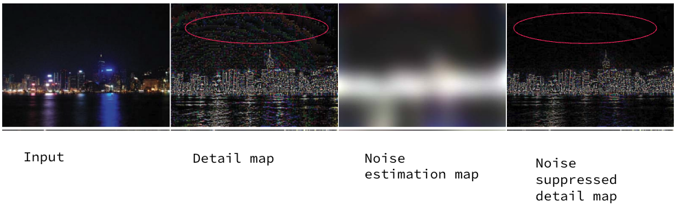
    

      <figcaption>Figure 10: Noise suppresion in detail pathway [5].</figcaption>
  

</figure>

### Results

<figure>
  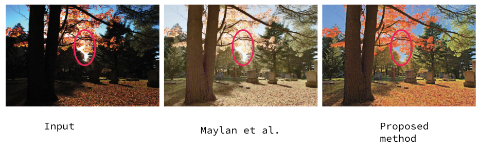
    

      <figcaption>Figure 11: comparison of proposed framework in low dynamic range image[5].</figcaption>
  

</figure>

## A novel biologically-inspired method for underwater image enhancement

Yan et al. [[2]](#2) proposed a novel method that takes inspiration from the color constatncy mechanism in photoreceptors horizontal cells to correct color distortion present in underwater images. Additionally,Horizontal cells modulation provides a global color correction with gaincontrol, in which ligh twavelength dependent absorption is taken into account. Then to remove the hazing effects and noise from the image they have  proposed a two pathway dehazing method. This method is inspired from the framework proposed by Yang et al. [[5]](#5). Additionally they have proposed innovative biological normalization model to adjust the dynamic range of luminance by integrating the bright and dark regions. The proposed framework is illustrated in Figure 12.

<figure>
  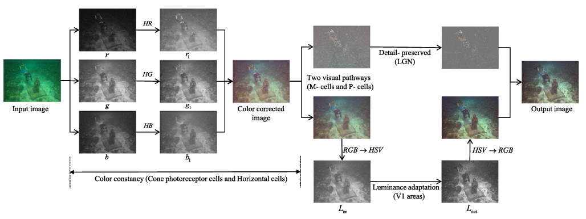
    

      <figcaption>Figure 12: Proposed framework, HR: Red sensitive Horizontal cells, HG: Green sensitive Horizontal cells, HB: Blue sensitive Horizontal cells  image[2].</figcaption>
  

</figure>

### Color constancy method

Underwater images often are color biased due to light attenuation or complex sources. Hence it's very crucial to handle the color distortion before applying other image enhancement techniques. The cone cells can be divided into long, medium and short category depending upon the most sensitive spectral wavelength. The proposed model applies a 2D gaussian filter to simulate the receptive filed of each type of cones. This results in three different channels for red, green and blue colors. After the cone cells absorb light, Horizontal Cells (HCs) help to integrate and adjust signal from cones. The authors have applied gamma correction on each of the channel forsimulating Horizontal cells. The gamma value has to be adaptive to incorporate different types of color distortions. The gamma value is calculated as a ratio of mean value of input image with mean value of well preserved channel. This is depicted in Figure 13. 

<figure>
  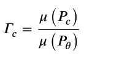
    

      <figcaption>Figure 13: adaptive gamma simulating horizontal cells image[2].</figcaption>
  

</figure>

Here $\mu(P_{c})$ denotes the mean value of $P_{c}$ and $\theta = argmax (\mu(P_{c}))$. The comparisong of the proposed color constancy method with other methods is depicted in Figure 14. 

<figure>
  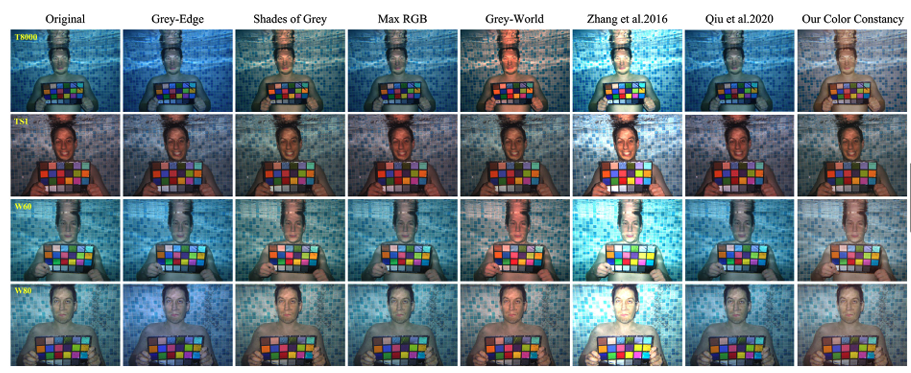
    

      <figcaption>Figure 14: qualitative comparison of proposed color constancy method[2].</figcaption>
  

</figure>

### Results

<figure>
  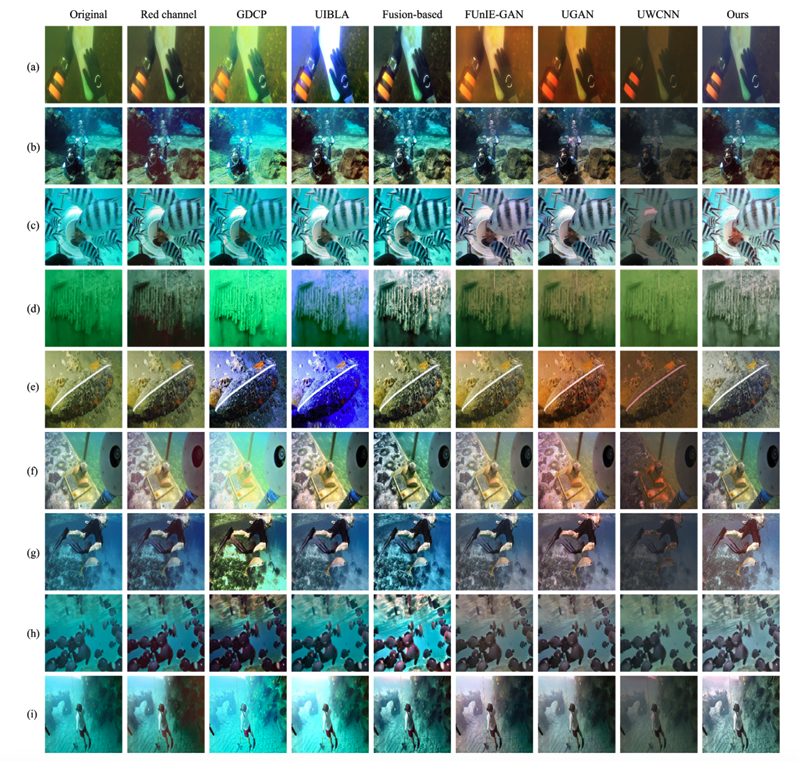
    

      <figcaption>Figure 14: qualitative comparison of proposed approach [2].</figcaption>
  

</figure>

## Ethical questions

## References
<a id="1">[1]</a> 
Zheng, Meicheng, and Weilin Luo. "Underwater image enhancement using improved CNN based defogging." Electronics 11, no. 1 (2022): 150.

<a id="2">[2]</a> 
Yan, Xiaohong, et al. "A novel biologically-inspired method for underwater image enhancement." Signal Processing: Image Communication 104 (2022): 116670.

<a id="3">[3]</a> 
Magnocellular and parvocellular pathways chapter from sensation and perception book https://pressbooks.umn.edu/sensationandperception/chapter/magnocellular-and-parvocellular-pathways/

<a id="4">[4]</a> 
Parasol cell wikipedia page https://en.wikipedia.org/wiki/Parasol_cell

<a id="5">[5]</a>
Yang, Kai-Fu, Xian-Shi Zhang, and Yong-Jie Li. "A biological vision inspired framework for image enhancement in poor visibility conditions." IEEE Transactions on Image Processing 29 (2019): 1493-1506.

<a id="6">[6]</a> 
 J.-F. Aujol, G. Gilboa, T. Chan, and S. Osher, “Structure-texture image
decomposition—Modeling, algorithms, and parameter selection,” Int. J.
Comput. Vis., vol. 67, no. 1, pp. 111–136, 2006

<a id="7">[7]</a> 
X. Pu, K. Yang, and Y. Li, “A retinal adaptation model for HDR
image compression,” in Proc. CCF Chin. Conf. Comput. Vis. Singapore:
Springer, 2017, pp. 37–47